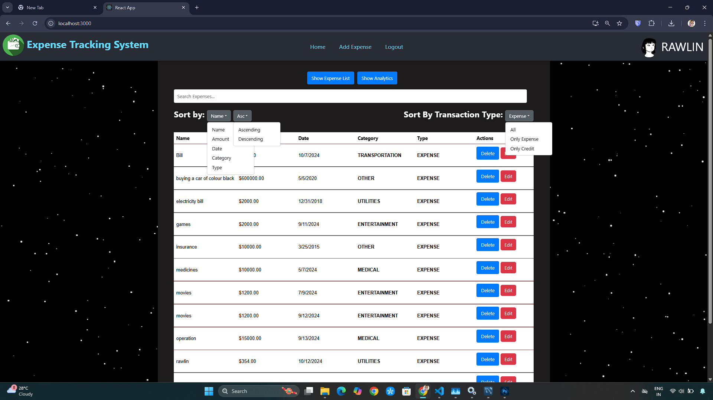
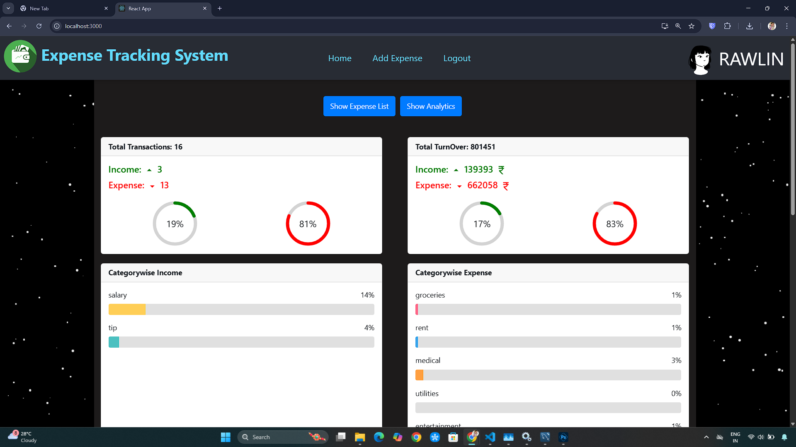
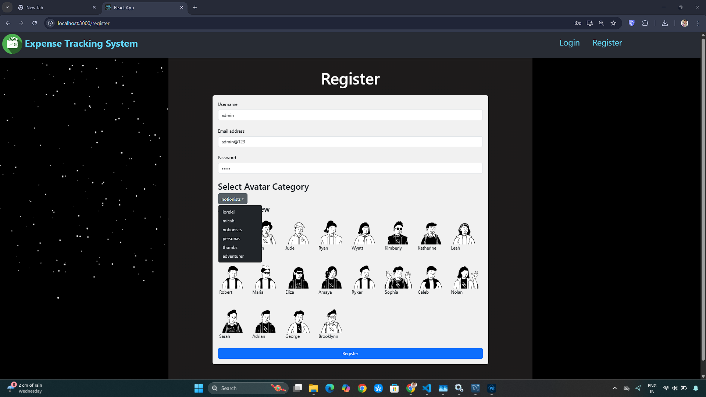
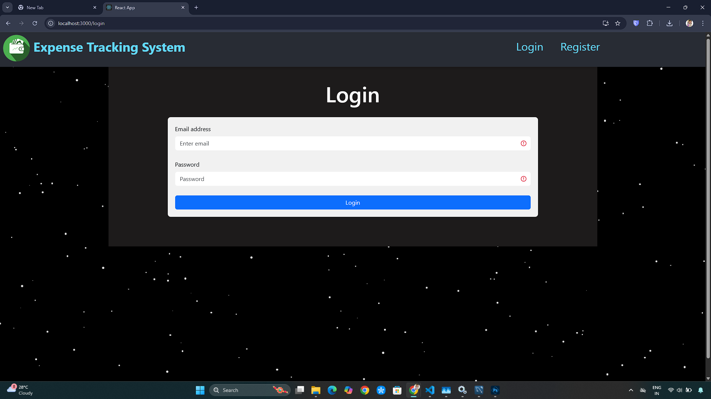

# Expense Tracking System

A full-stack web application to manage, track, and visualize expenses and credits.  
Built with **React**, **Node.js**, **Express**, **MySQL**, and **JWT authentication**, this app provides a secure and user-friendly interface for tracking financial activities with insightful charts and progress bars.  

## Dashboard

## Insights

## Register Page

## Login Page

---

## Features
- User Authentication with JSON Web Tokens (JWT)  
- Add, View, and Delete expenses & credits  
- Visual Insights using charts and progress bars  
- Tracks transactions over time  
- MySQL Database for persistent storage  
- Secure API routes with token-based authentication  

---

## Tech Stack
**Frontend**: React, Axios, Chart.js  
**Backend**: Node.js, Express.js  
**Database**: MySQL  
**Authentication**: JWT (JSON Web Token)  

---

## Installation & Setup

### 1️ Clone the Repository
```bash
git clone https://github.com/Rawlinrepo/Expense-tracking-system.git
cd Expense-tracking-system
```
---
### 2️ Install Backend Dependencies
```bash
cd backend
npm install
```
### 3️ Install Frontend Dependencies
```bash
cd ../frontend
npm install
```
---

### 4️ Start the Backend Server
```bash
cd backend
node server.js
```

### 5️ Start the Frontend
```bash
cd ../frontend
npm start
```
